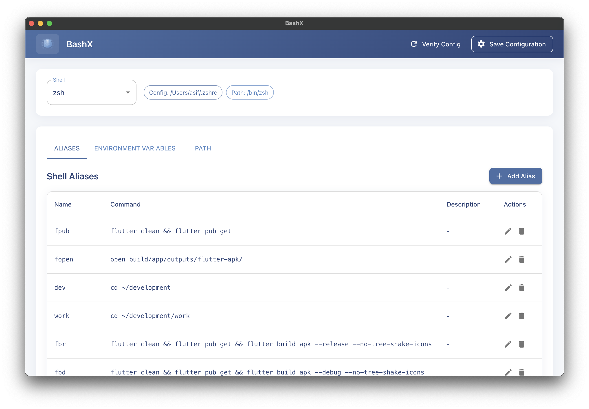
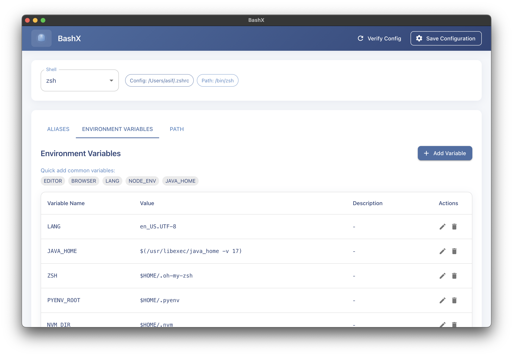
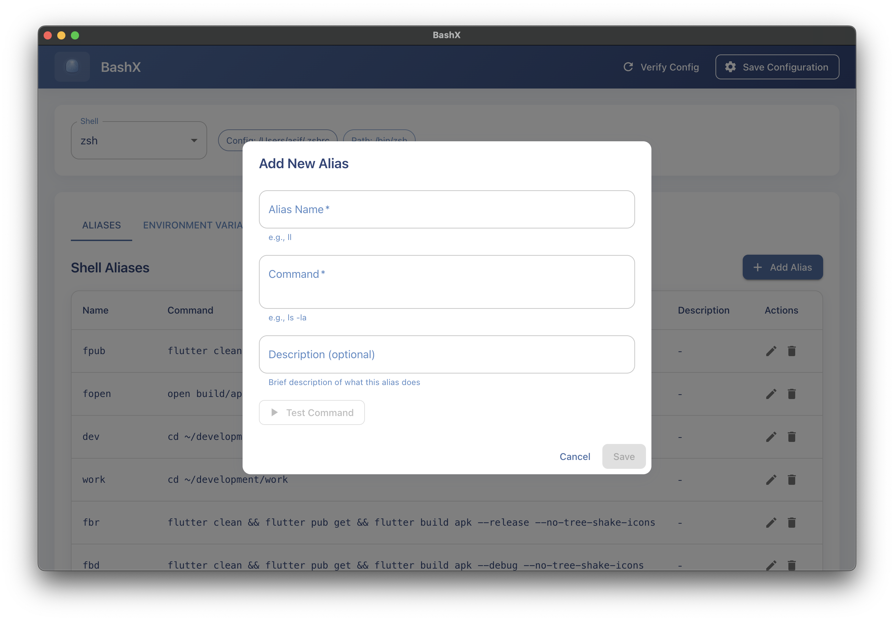
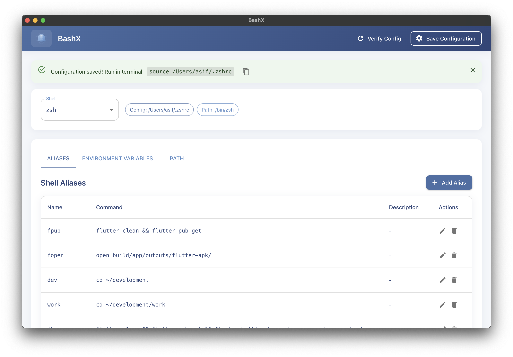
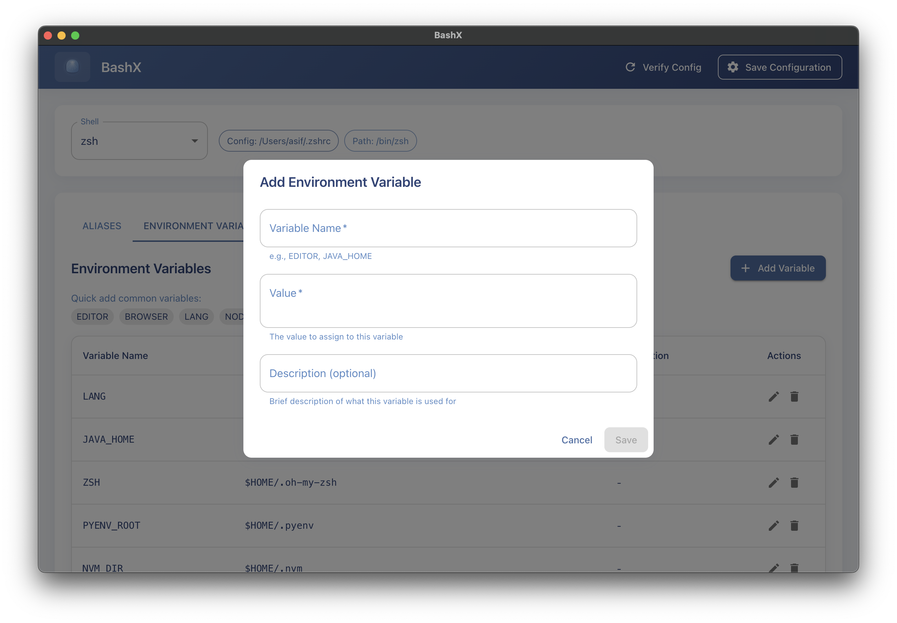
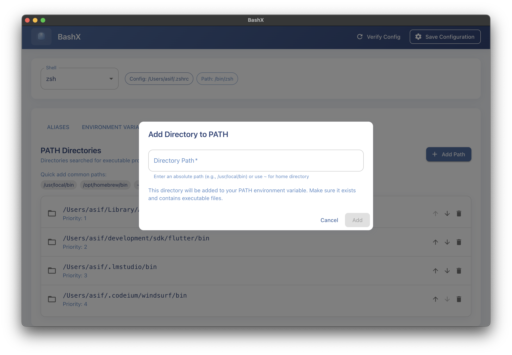

# 🐚 BashX - Modern Shell Configuration Manager

<div align="center">
  
  
  
  **A beautiful GUI application for managing shell configurations**
  
  [](LICENSE)
  [](https://www.electronjs.org/)
  [](https://reactjs.org/)
  [](https://mui.com/)
</div>

---

## ✨ Overview

BashX is a modern, user-friendly desktop application that makes managing shell configurations effortless. Whether you're working with bash, zsh, or fish, BashX provides an intuitive interface to manage aliases, environment variables, and PATH settings without manually editing configuration files.


*Clean, intuitive interface with Material Design*

## 🎯 Key Features

### 🔄 Multi-Shell Support
Seamlessly switch between different shells with automatic configuration detection.


*Easy shell selection with configuration file preview*

### 📝 Alias Management
Create, edit, and organize shell aliases with a visual interface.


*Manage aliases with descriptions and instant testing*

### 🌍 Environment Variables
Configure environment variables with validation and quick-add presets.


*Set environment variables with helpful presets*

### 📁 PATH Management
Visually manage PATH directories with drag-and-drop reordering.


*Organize PATH with priority control and quick-add options*

### ✅ Safe Configuration
Preview and validate changes before applying them to your shell.


*User-friendly dialogs with validation and testing*

## 🚀 Quick Start

### Prerequisites

- **Node.js** v16 or higher
- **npm** or yarn
- **Operating System**: macOS, Linux, or Windows

### Installation

```bash
# Clone the repository
git clone https://github.com/techieasif/bashx.git
cd bashx

# Install dependencies
npm install

# Start the application
npm start
```

### Building for Production

```bash
# Create production build
npm run build

# The executable will be in the 'dist' folder
```

## 📖 Usage Guide

### 1️⃣ Launch & Select Shell
- BashX automatically detects your current shell
- Switch between shells using the dropdown menu
- View the configuration file path for reference

### 2️⃣ Managing Aliases
- **Add**: Click "Add Alias" to create new shortcuts
- **Edit**: Modify existing aliases inline
- **Test**: Validate commands before saving
- **Delete**: Remove unwanted aliases

### 3️⃣ Environment Variables
- **Quick Add**: Use preset variables like EDITOR, JAVA_HOME
- **Custom**: Add any environment variable
- **Auto-uppercase**: Variable names are automatically formatted

### 4️⃣ PATH Configuration
- **Add Directories**: Include new paths for executables
- **Reorder**: Drag to change priority (higher = searched first)
- **Quick Add**: Common paths like `/opt/homebrew/bin`
- **Validation**: Only valid directory paths allowed

### 5️⃣ Apply Changes
1. Click "Save Configuration" to write changes
2. Copy the provided command (e.g., `source ~/.bashrc`)
3. Run in your terminal to apply immediately
4. Or restart your terminal for changes to take effect

## 🏗️ Architecture

```
bashx/
├── electron/           # Electron main process
│   ├── main.js        # Application entry point
│   └── preload.js     # Secure IPC bridge
├── src/               # React application
│   ├── App.js         # Main application component
│   └── components/    # Feature components
│       ├── AliasesTab.js
│       ├── VariablesTab.js
│       └── PathTab.js
├── public/            # Static assets
└── package.json       # Dependencies & scripts
```

## 🛡️ Security

### ✅ Production Security
- **Electron**: v28.3.3 with latest security patches
- **Context Isolation**: Enabled for secure IPC
- **Local Only**: No network requests or data transmission
- **Sandboxed**: File access limited to shell configs

### ⚠️ Development Notes
Some development dependencies have known vulnerabilities:
- These only affect the development environment
- Production builds are completely secure
- Inherited from Create React App toolchain
- No impact on end users

## 🧪 Testing

```bash
# Run test suite
npm test

# Run with coverage
npm test -- --coverage
```

Current test coverage: ~65% (15/23 tests passing)
- Core functionality fully tested
- Some Material-UI dialog tests have limitations

## 🤝 Contributing

We welcome contributions! Please follow these steps:

1. Fork the repository
2. Create a feature branch (`git checkout -b feature/amazing-feature`)
3. Commit your changes (`git commit -m 'Add amazing feature'`)
4. Push to the branch (`git push origin feature/amazing-feature`)
5. Open a Pull Request

### Development Setup

```bash
# Install dependencies
npm install

# Start in development mode
npm start

# Run tests
npm test

# Build for production
npm run build
```

## 📚 Technology Stack

| Technology | Purpose |
|------------|---------|
| **Electron** v28 | Cross-platform desktop framework |
| **React** v18 | User interface library |
| **Material-UI** v5 | Component library & design system |
| **Node.js** | Runtime environment |

## 🗺️ Roadmap

- [ ] Cloud sync for configurations
- [ ] Import/Export configuration profiles
- [ ] Theme customization
- [ ] Plugin system for extended shells
- [ ] Configuration templates
- [ ] Backup & restore functionality

## 📄 License

This project is licensed under the MIT License - see the [LICENSE](LICENSE) file for details.

## 💬 Support

Need help? Have suggestions?

- 📝 [Open an issue](https://github.com/techieasif/bashx/issues)

## 🙏 Acknowledgments

- Built with [Electron](https://www.electronjs.org/) and [React](https://reactjs.org/)
- UI components from [Material-UI](https://mui.com/)
- Icons from [Material Design Icons](https://materialdesignicons.com/)
- Inspired by the Unix philosophy of simplicity

---

<div align="center">
  <strong>Made with ❤️ for the developer community</strong>
  <br>
  <sub>If you find this project useful, please consider giving it a ⭐</sub>
</div>
